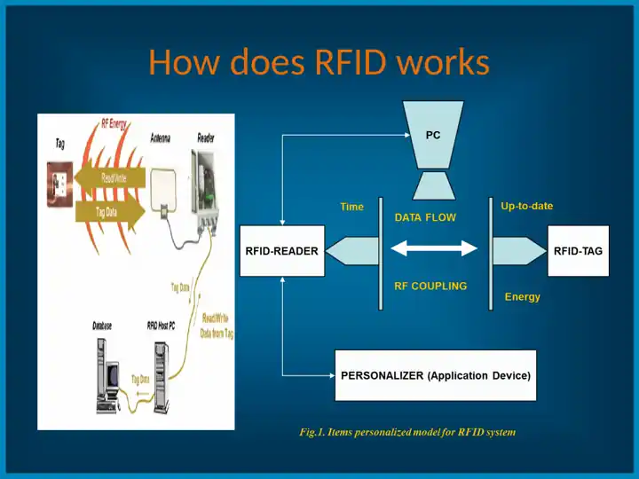
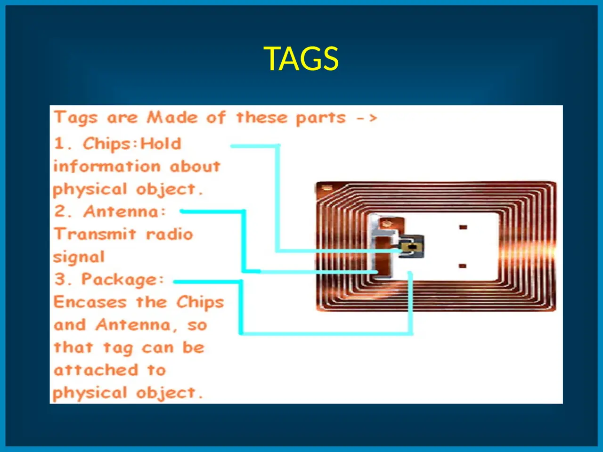
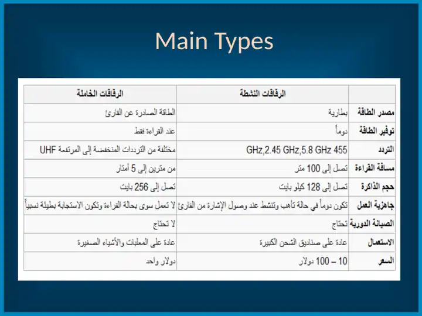

# RFID Library Automation System (ISO 15693)

Implemented a radio-frequency identification (RFID) system for library automation. Each item carries a tag, readers identify items over RF without line of sight, and a host database records every transaction. This replaces manual handling and barcode scanning for check-in/out, security and inventory.

## Role

Design, implementation and technical presentation of the system.

## How RFID works

1. The **reader** sends RF energy through its antenna.
2. The **tag** in that field powers up through RF coupling.
3. The tag returns its stored data.
4. The reader forwards the tag data to the **RFID host PC**.
5. The host PC logs the data in the **database**. It can also write updated data back to the tag.

A personalizer (application device) registers and programs the tags for the items.

## System components

| Component | Function |
|---|---|
| Reader + antenna | Energizes tags, reads and writes tag data |
| Tags | Attached to each item; hold the item's identity |
| Host PC + database | Stores items and transactions; drives the library workflow |
| Personalizer | Programs tags for new items |

## Tag structure

A tag is made of three parts:

- **Chip:** holds the information about the physical object.
- **Antenna:** transmits the radio signal.
- **Package:** encases the chip and antenna so the tag can be attached to the object.

## Tag types

The deck lists five tag categories: active, passive, semi-passive, extended-capability and other. Active and passive tags compare as follows:

| | Active tags | Passive tags |
|---|---|---|
| Power source | Battery | Energy from the reader |
| Power availability | Always on | Only while being read |
| Frequency | 455 MHz, 2.45 GHz, 5.8 GHz | Low frequencies up to UHF |
| Read range | Up to 100 m | 2–5 m |
| Memory | Up to 128 KB | Up to 256 bytes |
| Readiness | Always ready; responds when the reader's signal arrives | Works only when read; relatively slower response |
| Periodic maintenance | Required | Not required |
| Typical use | Large shipping containers | Files and small items |
| Cost | USD 10–100 | About USD 1 |

Passive tags suit library items because they are cheap, need no battery or maintenance, and their read range fits counters and gates.

## Library reader specification

| Parameter | Value |
|---|---|
| Standard | ISO 15693 |
| Frequency | 13.56 MHz |
| Dimensions | 400 × 200 × 120 mm |
| Housing | Metal |
| Data interface | RS-232 |
| Protocol | SIP and/or API (STX/ETX communication protocol in use) |
| Indicators | Tag-data LED and power LED |
| Supply voltage | 230 V |
| Certification | CE and radio approval |

## Library applications

The system serves these library stations:

- staff circulation counter;
- self check-in/out kiosk;
- handheld inventory reader at the shelves;
- book-drop;
- security gates at the exit;
- tagged items.

## Benefits

- **Materials control:** fast inventorying, searching and notifying.
- **Circulation:** faster check-out and check-in.
- **Tags:** long-lasting.
- **Security:** theft prevention.
- **Staff:** reduced workload.
- **Reporting:** usage statistics are easy to gather.

## Background

RFID traces back to 1945, when Léon Theremin built a covert listening device. It was passive: it was energized and activated by incoming radio waves and modulated the waves it reflected. That principle is still used by passive tags today.

## Technologies

RFID, ISO 15693, 13.56 MHz, RS-232, SIP / STX-ETX, passive tags, library automation

## Credits

- **Academic supervisor:** Dr. Abdulsalam Alkholidi. Faculty of Engineering, Sana'a University.
- **Images:** slides from the project presentation.

## Links

- [Portfolio project](https://mahyoub88.github.io/#proj-rfid-study)
