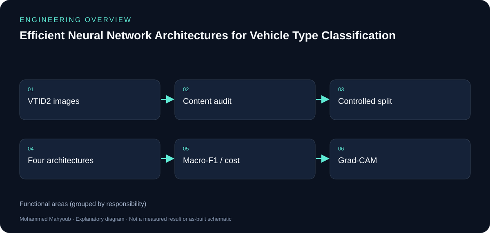
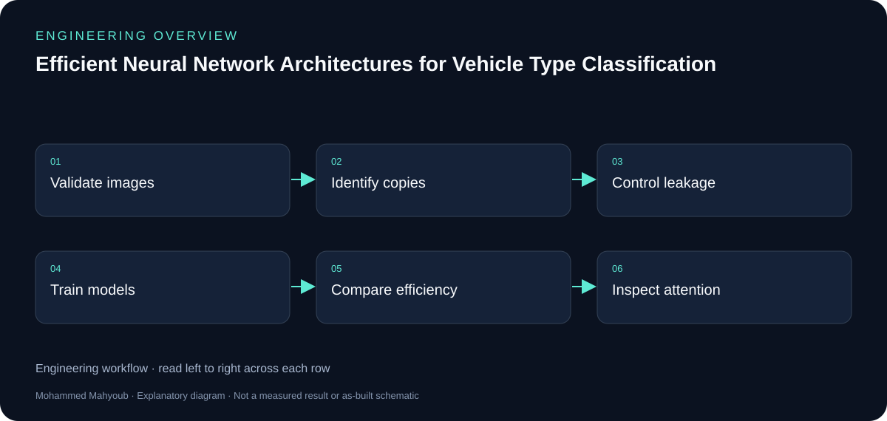

# Efficient Neural Network Architectures for Vehicle Type Classification — Engineering Guide

Developed and evaluated neural network architectures for vehicle type classification using the VTID2 image dataset. The evaluated architectures included an MLP, a standard CNN, an efficient depthwise-separable CNN, and an efficient CNN with Squeeze-and-Excitation.

## Visual overview

*New explanatory diagram; grouped responsibilities, not an as-built schematic or test result.*

*New explanatory workflow; a documentation aid, not evidence that every proposed check was performed.*

## Data quality before accuracy

The content audit found 4,356 valid images, of which 2,425 were redundant exact copies. The remaining 1,931 exact-unique images make clear why evaluation design matters: copies can cross an image-level train/test boundary and inflate apparent generalisation.

## Architecture comparison

The MLP establishes a non-convolutional baseline. A standard CNN is compared with a depthwise-separable CNN and a version with Squeeze-and-Excitation. The comparison considers Macro-F1 together with trainable parameters, multiply-accumulate operations and batch-one inference latency.

## Interpretation of published results

The public LinkedIn summary reports 87.24% fewer parameters and 81.67% fewer MACs for the efficient CNN, with a mean Macro-F1 difference of 0.0150. Conventional and controlled protocols also differ in data composition and training settings; their performance gap is a diagnostic comparison, not a causal estimate of leakage.

## Explainability and access

Grad-CAM investigates attention to vehicle regions and preprocessing padding. These public summaries do not release the assessment notebook, source code or private dataset artifacts. Code remains private during assessment.

## Evidence to review or collect

The following are suggested review checks. A checklist entry is not a claimed pass result.

- Duplicate audit and split identity checks.
- Model/protocol configuration.
- Classwise results and uncertainty.
- Latency environment and Grad-CAM examples.

## Sources and provenance

- [Published portfolio description](https://mahyoub88.github.io/#proj-vtid2).
- [LinkedIn projects](https://www.linkedin.com/in/mohammed-mahyoub/details/projects/): supplementary descriptions and project media.
- New SVG figures and explanatory text were authored for this documentation update; they are not original photographs or new measured results.
- Original implementation photos and raw results were not available in the inspected public repository; the new diagrams provide explanation without substituting for that evidence.
